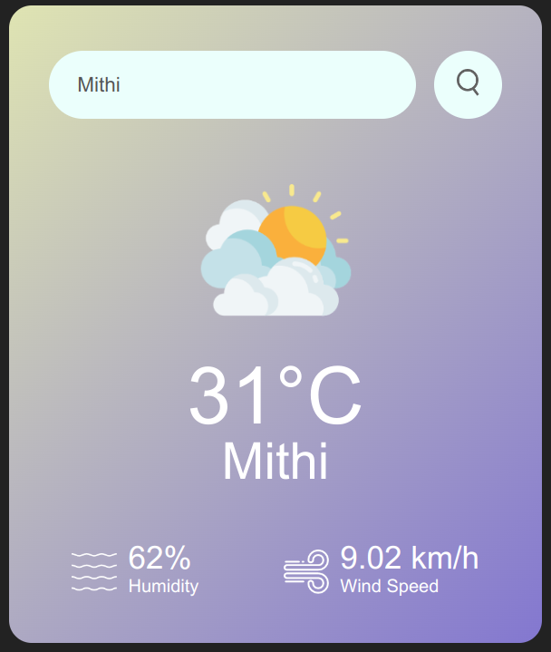

# Basic-Weather-Application

A simple weather application for displaying current weather information on a website. The app retrieves weather data from the OpenWeatherMap API and presents it in a user-friendly manner, showing temperature, weather condition, humidity, and wind speed for a specified city. 

